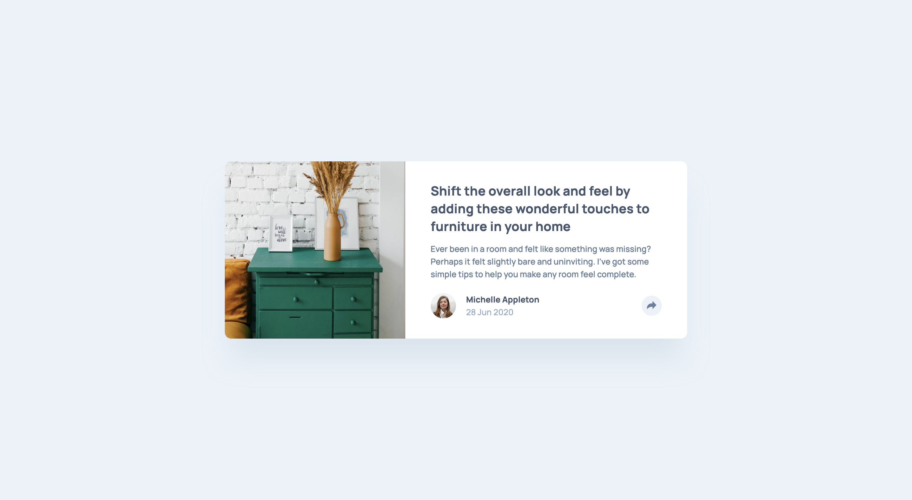

# Article Preview Component Solution

This is a solution to the [Article preview component challenge on Frontend Mentor](https://www.frontendmentor.io/challenges/article-preview-component-dYBN_pYFT). The goal was to build a fully responsive article preview card using **HTML**, **CSS**, and **JavaScript** for interactive functionality.

## Technologies Used

- **HTML**: For the structure of the card component
- **CSS**: For styling the card and ensuring responsiveness
- **JavaScript**: For the share button's interactivity

## Screenshot and Links

| [Frontend Mentor](https://www.frontendmentor.io/solutions/article-preview-component-6ZjBcUdUz_) | [Live Demo URL](https://ionstici.github.io/article-preview-component) |
| ----------------------------------------------------------------------------------------------- | --------------------------------------------------------------------- |

## Learnings

This challenge focused on implementing clean and semantic HTML, maintaining a responsive design using CSS, and adding simple interactivity using vanilla JavaScript. A great exercise in building small, focused UI components.
